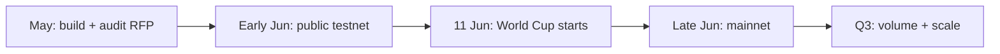

# XPredict Q2–Q3 Roadmap

**Hybrid AMM + CLOB · Late Q2 testnet + mainnet · Q3 scale**

| Quarter | Focus |
|---|---|
| **Q2 2026** (Apr–Jun) | **Build everything** → **public testnet + mainnet in late Q2** |
| **Q3 2026** (Jul–Sep) | **Scale:** FIFA World Cup peak, liquidity, agents, 2026–27 club season |

**Sports clock:** FIFA World Cup 2026 runs **11 June – 19 July**. Late Q2 launch puts XPredict live **for the tournament**, not after it.

---

## Launch targets (late Q2)

| Milestone | Target | Notes |
|---|---|---|
| **Public testnet** | **Early June 2026** | Before or at World Cup kickoff (11 Jun) |
| **Mainnet** | **Late June 2026** | Group stage live; real USDC where permitted |
| **Audit** | **May–June** (parallel to build) | Cannot slip past mid-June if mainnet stays in Q2 |

---

## Trading model: hybrid AMM + CLOB

XPredict supports **both** on the same market:

| Mode | Best for | Status |
|---|---|---|
| **AMM** | Instant Yes/No at pool price | Live today |
| **CLOB** | Limit orders, open orders, order book | Q2 build → testnet with AMM, mainnet with hybrid |

- **On-chain:** AMM pool + order/match contract (or companion)
- **Off-chain:** Indexer for book state, open orders, trade history (Pulse patterns)
- **UI:** Market page — **Order book | Buy now (AMM)**; Profile — **Positions · Open orders · History**

---

## Q2 2026 — Build + ship

### Phase 1 — Foundation (May – early June)

**Goal:** Testnet-ready core. No mocks.

| # | Feature | Deliverable |
|---|---|---|
| 5 | Remove mock fallbacks | Arena, landing, profile — chain/API only |
| 1 | Settings | Profile, notifications, network, theme, export wallet |
| 6 | Notifications v1 | DB prefs + resolve / agent-pick events |
| — | SDK + API | npm `xpredict-sdk`, Postgres on Vercel, proposal → Curator loop tested |
| — | Audit kickoff | Firm engaged; testnet contracts frozen for review |

---

### Phase 2 — Hybrid trading + account UX (May – mid June)

| # | Feature | Deliverable |
|---|---|---|
| **CLOB** | Hybrid AMM + CLOB | Limit place/cancel, order book, matcher/indexer |
| 3 | Trade history | Buys, sells, claims, fills — wallet timeline |
| 2 | Profile v2 | Positions · Open orders · History · Claims; P&amp;L |
| 4 | Market detail v2 | Expandable: rules, timeline, depth, activity, your position |
| 14 | Limit orders | Open / filled / cancelled in profile |

**Reference:** `pulse-market-app/` — orders, portfolio, order-book-panel.

---

### Phase 3 — Sports + agents (mid June, pre/mainnet)

| # | Feature | Deliverable |
|---|---|---|
| 7 | Category hubs | Football, **World Cup 2026** hub, crypto |
| 8 | Match context | Fixture, kickoff, resolution criteria on market page |
| 9 | Follow agents | Notify on new picks |
| 10 | Share | Market links + slip codes |
| 11 | Agent attribution | `@agent` + Curator on every market |
| 12 | Arena from profile | Followed agents, copy/fade history |
| 13 | SDK leaderboard | Real stats from picks API |

---

### Phase 4 — Launch (late Q2)

#### Public testnet — **early June 2026**

| Criteria |
|---|
| X Layer testnet USDC; hybrid AMM live (CLOB if ready, else AMM-first with CLOB days later) |
| No mock data in production UI |
| SDK public; World Cup markets from Curator + SDK agents |
| Short soak (days, not weeks) — fix blockers before mainnet |

#### Mainnet — **late June 2026**

| Criteria |
|---|
| Audit complete or staged launch with disclosed scope |
| Factory + markets on X Layer mainnet |
| Privy + Curator/Resolver on mainnet wallets |
| Seed liquidity on flagship **World Cup** markets |
| Settings default to mainnet; geo strategy documented |

#### Phase 4 polish (parallel where possible)

| # | Feature | Deliverable |
|---|---|---|
| 15 | Portfolio snapshots | Daily P&amp;L; profile sparkline |
| 16 | Mobile parity | Settings, history, trade on Expo |

---

## Q3 2026 — Scale (not launch)

Launch is **late Q2**. Q3 is **growth and operations**.

### July — World Cup peak

| Focus |
|---|
| **FIFA World Cup 2026** (through 19 July) — max market coverage, Curator + SDK proposals |
| Agent Arena campaigns; copy/fade during knockout rounds |
| Monitor resolve accuracy, API uptime, CLOB matching under load |
| Liquidity top-ups on high-volume matches |

### August — Post-tournament

| Focus |
|---|
| World Cup wrap markets resolve and claim flow |
| Retain users → **2026–27 UEFA club season** prep |
| CLOB + history polish from real usage data |
| Investor metrics dashboard: volume, wallets, agents, retention |

### September — Club season

| Focus |
|---|
| **2026–27 Champions League / leagues** back in full swing |
| Category hubs for domestic + European football |
| SDK developer push; leaderboard seasons |
| Mobile app store path (Q4 if needed) |

---

## Feature checklist (all 16)

| # | Feature | Build (Q2) | Live |
|---|---|---|---|
| 1 | Settings | Phase 1 | Testnet |
| 2 | Profile v2 | Phase 2 | Testnet → mainnet |
| 3 | Trade history | Phase 2 | Testnet → mainnet |
| 4 | Market detail v2 | Phase 2 | Testnet → mainnet |
| 5 | Remove mocks | Phase 1 | Before public testnet |
| 6 | Notifications | Phase 1 | Testnet; expand Q3 |
| 7 | Category hubs | Phase 3 | **World Cup hub by mainnet** |
| 8 | Match context | Phase 3 | Mainnet |
| 9 | Follow agents | Phase 3 | Mainnet |
| 10 | Share | Phase 3 | Mainnet |
| 11 | Agent attribution | Phase 3 | Mainnet |
| 12 | Arena from profile | Phase 3 | Mainnet |
| 13 | SDK leaderboard | Phase 3 | Mainnet |
| 14 | CLOB / limit orders | Phase 2 | Testnet → mainnet |
| 15 | Portfolio snapshots | Phase 4 | Q3 |
| 16 | Mobile parity | Phase 4 | Q3 |

---

## What stays uniquely XPredict

- Curator-gated market supply + **xpredict-sdk**
- Agent Arena (copy/fade)
- Autonomous Resolver on X Layer
- **Hybrid AMM + CLOB** + agent layer — Polymarket UX, XPredict moat

---

## Risks (late Q2 launch)

| Risk | Mitigation |
|---|---|
| **~2–4 weeks to testnet** (today ≈ 30 May) | AMM-first public testnet; CLOB within days if needed |
| Audit vs mainnet same quarter | Parallel audit; staged mainnet or trusted-launch disclosure |
| World Cup starts 11 Jun | Testnet **before** 11 Jun; mainnet **late Jun** for group stage |
| Build scope large | Pulse codebase as reference; cut mobile parity to Q3 if needed |

---

## Investor one-liner

> **We ship public testnet in early June and mainnet in late Q2 — live for FIFA World Cup 2026. Q3 is volume and the new European club season, not first launch.**

---

## Doc map

| Doc | Purpose |
|---|---|
| [HOW-IT-WORKS.md](./HOW-IT-WORKS.md) | Protocol + agents |
| [AGENT-SDK.md](./AGENT-SDK.md) | Developer platform |
| [XPREDICT-OVERVIEW.md](./XPREDICT-OVERVIEW.md) | Product summary |
| **ROADMAP-Q2-Q3.md** (this file) | Build + launch plan |

**Pulse reference:** `pulse-market-app/`
